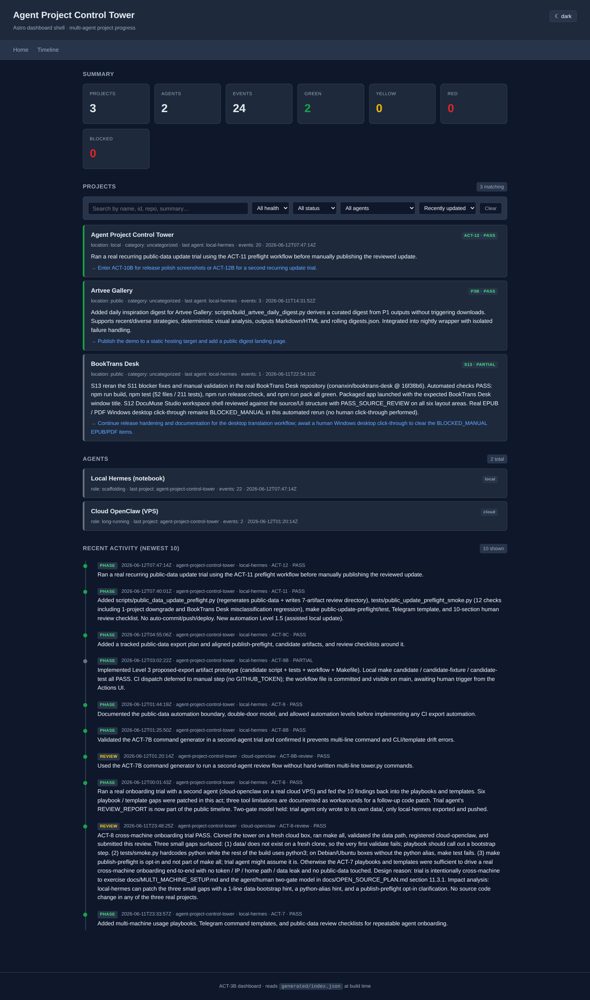
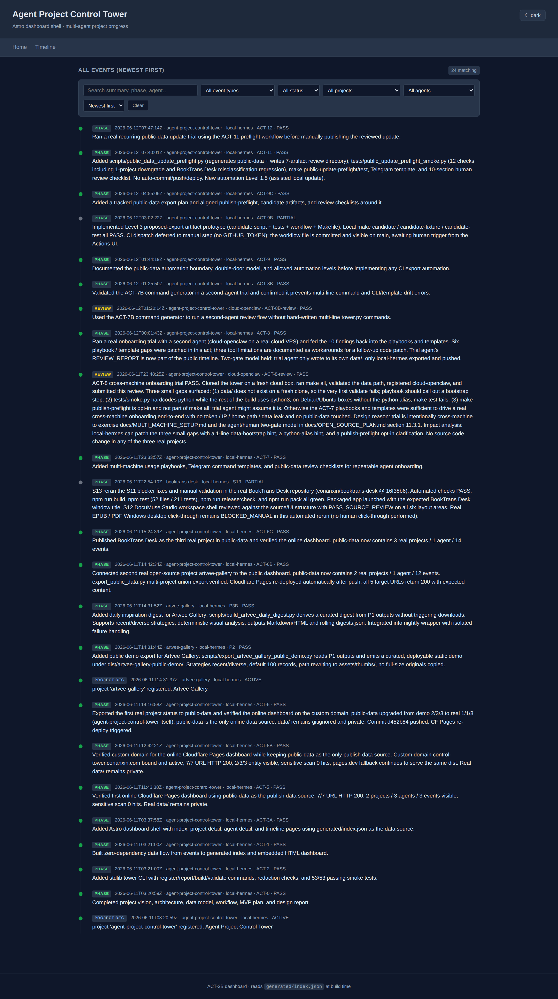
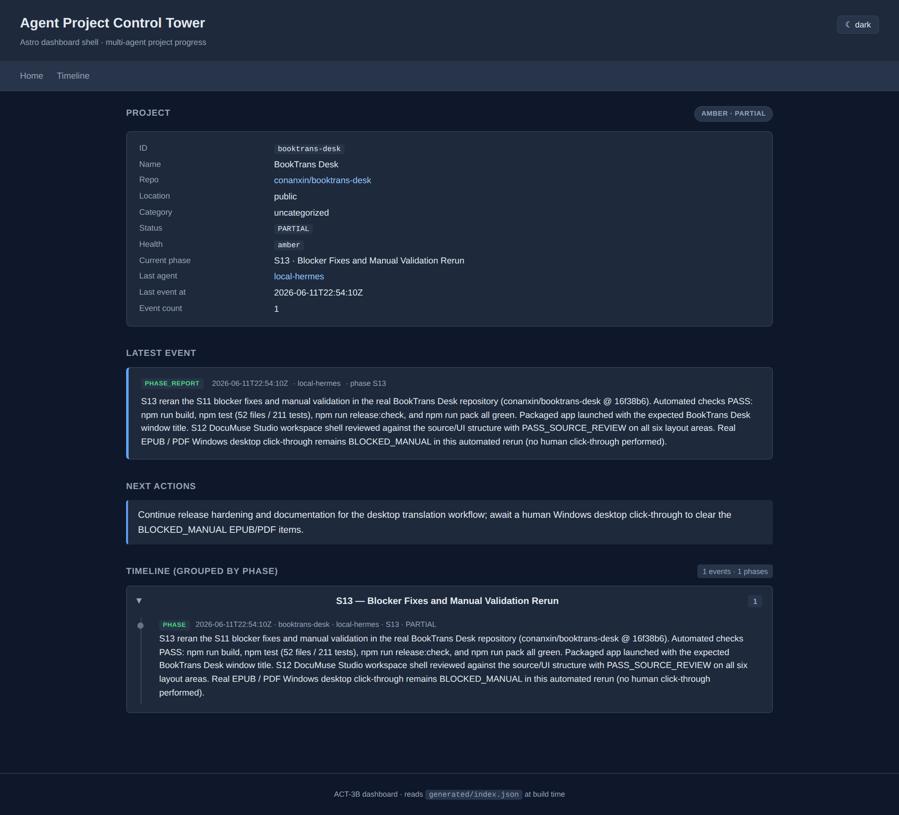
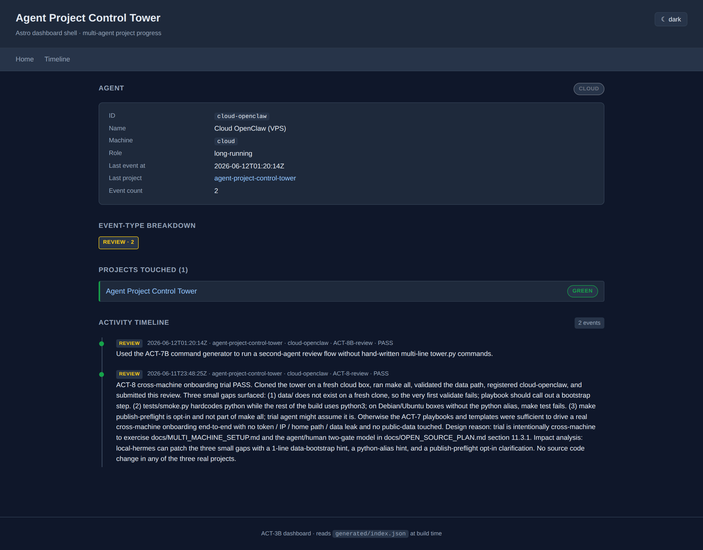
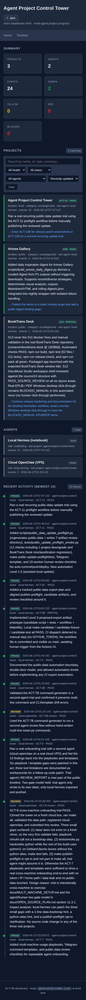

# Agent Project Control Tower

> 一个统一的"项目管理控制塔"——把分散在不同机器、不同 agent 上的多个开源项目，集中到一个 Git 仓库 + 一个静态网页里。
>
> 🌍 **GitHub**: <https://github.com/conanxin/agent-project-control-tower>（public，ACT-4B 已 push）
> 🚀 **Online Dashboard (custom domain)**: <https://control-tower.conanxin.com/>（ACT-5B ✅ 已绑 custom domain）
> 🔁 **Online Dashboard (pages.dev fallback)**: <https://agent-project-control-tower.pages.dev/>（ACT-5 ✅，与 custom domain 服务同一份 dist）
|> 🟢 **状态**: v0.1.0 ✅ RELEASED + ACT-10B ✅ COMPLETE（GitHub release polish / screenshots / release notes）|
|> 🟢 **当前线上真实项目**: `agent-project-control-tower` + `artvee-gallery` + `booktrans-desk`（BookTrans Desk 已修正为 `conanxin/booktrans-desk` / S13 / `16f38b6` / PARTIAL）|
|> 🟢 **当前线上 agent**: `local-hermes` + `cloud-openclaw`（trial agent 公开）|
|> 🟢 **当前 public-data**: 3 projects / 2 agents / 24 events |
|> 📸 **v0.1.0 screenshots**: [docs/media/v0.1.0/](docs/media/v0.1.0/)（6 PNGs, 桌面 + 移动, 实时截自线上 dashboard）|
|> 📋 **Release notes**: [docs/release/RELEASE_NOTES_v0.1.0.md](docs/release/RELEASE_NOTES_v0.1.0.md) |
|> 📋 **Changelog**: [CHANGELOG.md](CHANGELOG.md) |
|> 🔄 **日常更新 public-data**: `make public-update-preflight`（ACT-11）→ 看 `artifacts/public-data-update-preflight/` → 显式 `git add` → commit + push（ACT-12 已真实验证）|
|> ⏸ **下一步**: ACT-12B（second recurring update trial）或 ACT-13（adoption packaging）|

---

## 🚀 Start here

If you are a new agent (or a new human) opening this repo for the first
time, follow this order:

1. Read `docs/AGENT_USAGE_PLAYBOOK.md` — the main handbook.
2. For new machines / new agent personas, read
   `docs/MULTI_MACHINE_SETUP.md`.
3. For public dashboard / `public-data/` export questions, read
   `docs/PUBLIC_DATA_EXPORT_PLAYBOOK.md`.
4. Use the copy-paste Telegram command templates in
   `templates/telegram/*.txt` to command an agent.
5. Before any commit touching `public-data/`, walk through
   `templates/checklists/preflight-checklist.md` and
   `templates/checklists/public-data-review-checklist.md`.
6. After any push, walk through
   `templates/checklists/online-verification-checklist.md`.

---

## ✅ Current recommended usage path

| You want to ... | Use this |
| --- | --- |
| Bring a new machine online | `docs/MULTI_MACHINE_SETUP.md` §1, §4.1 |
| Register a new agent persona | `docs/AGENT_USAGE_PLAYBOOK.md` §3 + `templates/telegram/register-agent.txt` |
| Register a new project | `docs/AGENT_USAGE_PLAYBOOK.md` §4 + `templates/telegram/register-project.txt` (注意 `repo` 必须指向真实代码仓库，详见 ACT-6C 教训) |
| Report a phase completion | `docs/AGENT_USAGE_PLAYBOOK.md` §5 + `templates/telegram/report-phase.txt` |
| Report a failure | `docs/AGENT_USAGE_PLAYBOOK.md` §6 + `templates/telegram/report-failure.txt` |
| Report a review / handoff / release | `docs/AGENT_USAGE_PLAYBOOK.md` §7, §8, §9 |
| Export redacted `public-data/` | `docs/PUBLIC_DATA_EXPORT_PLAYBOOK.md` + `templates/telegram/export-public-data.txt` |
| Verify a Cloudflare Pages deploy | `templates/telegram/cloudflare-verify.txt` + `templates/checklists/online-verification-checklist.md` |
| Avoid the ACT-6C mis-attribution bug | `docs/PUBLIC_DATA_EXPORT_PLAYBOOK.md` §7 |

## 🟢 Current live real projects

- **`agent-project-control-tower`** — this repo, `conanxin/agent-project-control-tower`, `local`, `agent-infra`. Tracks the tower itself.
- **`artvee-gallery`** — `conanxin/artvee-library`, `public`, `art-gallery`. Open-source art gallery + daily inspiration digest.
- **`booktrans-desk`** — `conanxin/booktrans-desk`, `public`, `reading-tool`. Open-source desktop tool for structured PDF and EPUB translation workflows. Current phase: **S13 (Blocker Fixes and Manual Validation Rerun)**, source commit `16f38b6`, status **PARTIAL/amber** (real Windows desktop click-through still `BLOCKED_MANUAL`).

## 🟢 Current live agents

- **`local-hermes`** — primary coding agent on the local notebook (WSL). `machine=local`, `role=scaffolding / orchestration / long-running`. Owns the public-data export gate.
- **`cloud-openclaw`** — secondary coding agent on a cloud VPS. `machine=cloud`, registered during the ACT-8 cross-machine onboarding trial. The ACT-8 review event it submitted is now part of the public timeline.

---

## 📸 Screenshots (v0.1.0)

All screenshots captured 2026-06-12 from the live dashboard at <https://control-tower.conanxin.com/>.

### Dashboard home — desktop



### Timeline (newest first)



### Project page — BookTrans Desk (S13 / PARTIAL)



### Agent page — cloud-openclaw (VPS secondary)



### Mobile view



> All assets in `docs/media/v0.1.0/` are tracked in git (small PNGs). Source: <https://control-tower.conanxin.com/>. Capture method and refresh instructions: [`docs/media/README.md`](docs/media/README.md).

> ⚠️ The dashboard renders a **reviewed public snapshot** of `public-data/`. The local `data/` event store is private and never published. BookTrans Desk shows `PARTIAL/amber` because the Windows desktop click-through remains `BLOCKED_MANUAL` (real-machine QA pending).

---

## 这个项目是什么

我同时在多台机器上、用多个 agent（Hermes、Codex、OpenClaw、Claude Code……）跑多个开源项目。每个项目仍然住在它自己的代码仓库里，由不同的 agent 接续开发、复查和发布。

问题在于：

- 项目状态散落在各机器的聊天记录、commit message、私人笔记里
- 我很难一眼看出：**哪些项目在跑、谁在跑、跑到第几阶段、卡在哪、下一步是什么**
- 想在线分享进展给协作者或社区时，要手动拼接截图和 commit 链接

**Agent Project Control Tower** 就是为了解决这个问题。它本身不写代码、也不替代原项目仓库——它只是一个"进度事实源"。

```
原项目仓库  ── push 阶段成果 ──>  控制塔仓库
                                     │
                                     ▼
                              GitHub Actions / Cloudflare Pages
                                     │
                                     ▼
                              在线 Dashboard
```

## 解决什么问题

| 没有控制塔时 | 有了控制塔之后 |
| --- | --- |
| "L2 那步到底过没过？让我翻聊天记录……" | 点开项目页，时间线一目了然 |
| 跨机器状态靠记忆 | 所有阶段事件按时间顺序沉淀到 Git |
| 想展示进展只能截聊天记录 | 公开 URL，访客直接看 |
| 失败/阻塞靠口口相传 | FAIL/BLOCKED 事件自动上墙 |
| 谁接手了哪个项目 | agents.yml + 最近 events 双视角 |

## 核心约定（先记住这几条就够用）

1. **原项目仓库不搬走**——你写的所有代码、commit、PR 仍然在 `~/workspace/projects/your-project/` 里。
2. **控制塔是一个独立的 Git 仓库**——里面只放"项目元数据 + 阶段事件 + 自动生成的网页"。
3. **agent 跑完一个阶段 → 写一个 event JSON → push 控制塔仓库**。
4. **任何人都能从在线 dashboard 看到状态**——不需要数据库，不需要登录。
5. **项目只注册一次；多个 agent 可以接力同一个项目**。

## 一次完整的使用模拟（极简版）

> 完整版在 [docs/USAGE_SIMULATION.md](docs/USAGE_SIMULATION.md)。

假设你在两台机器上跑两个项目：

| 项目 | 位置 | 主 agent |
| --- | --- | --- |
| `local-book-tool` | 笔记本 | 本地 Hermes |
| `cloud-art-site` | 云端 VPS | 云端 OpenClaw |

### 一次性：注册（每台机器、每个项目各一次）

```bash
# 在本地笔记本
tower register-agent \
  --id local-hermes \
  --machine local \
  --type hermes

tower register-project \
  --id local-book-tool \
  --repo https://github.com/you/local-book-tool \
  --scope local

# 在云端 VPS（操作一样，数据落在同一个控制塔仓库的 PR/分支里，或通过 SSH 推到 origin）
tower register-agent \
  --id cloud-openclaw \
  --machine cloud \
  --type openclaw

tower register-project \
  --id cloud-art-site \
  --repo https://github.com/you/cloud-art-site \
  --scope cloud
```

> 注意：你可以在**原项目目录里**执行 `tower report ...`，但命令背后实际是写文件 + commit/push 到**控制塔仓库**——不是写回原项目仓库。

### 持续：每完成一个阶段上报

```bash
# 本地 Hermes 完成 local-book-tool 的 L1
tower report phase \
  --project local-book-tool \
  --agent local-hermes \
  --phase L1 \
  --status PASS \
  --summary "Add book import CLI; tests green" \
  --next "L2: convert EPUB to Markdown"

# 云端 OpenClaw 完成 cloud-art-site 的 C1
tower report phase \
  --project cloud-art-site \
  --agent cloud-openclaw \
  --phase C1 \
  --status PASS \
  --summary "Static gallery generated, 120 images" \
  --next "C2: add tag filter UI"
```

### 一段时间后：本地 Codex 接手同一个本地项目

```bash
# 本地另一台机器 / 同一台机器的另一个 agent
tower report phase \
  --project local-book-tool \
  --agent local-codex \
  --phase L2 \
  --status FAIL \
  --summary "EPUB parser crashes on DRM-protected files" \
  --next "L2-fix: graceful skip + report"
```

### 自动发生：dashboard 重新构建

```
git push  →  GitHub Actions / Cloudflare Pages  →  在线 dashboard 刷新
```

访客打开 `https://control-tower.your-domain/`，看到：

- **首页**：3 个项目、2 个 agent、最近 24h 有 1 个 FAIL
- **项目页 `local-book-tool`**：时间线 L1 PASS（local-hermes）→ L2 FAIL（local-codex），health=yellow，下一步=L2-fix
- **agent 页 `local-codex`**：参与过 1 个项目，当前在 L2-fix 阶段

## 仓库里有什么

```
agent-project-control-tower/
├── README.md                  ← 你正在读的文件
├── Makefile                   ← ACT-1: validate / build / site / test
├── docs/                      ← 设计文档
│   ├── PROJECT_VISION.md
│   ├── USAGE_SIMULATION.md
│   ├── ARCHITECTURE.md
│   ├── DATA_MODEL.md
│   ├── AGENT_WORKFLOW.md
│   ├── MVP_PLAN.md
│   ├── OPEN_SOURCE_PLAN.md
│   ├── DEPLOYMENT_PLAN.md
│   └── RISKS_AND_BOUNDARIES.md
├── examples/                  ← ACT-1 的"事实源"
│   ├── projects.yml
│   ├── agents.yml
│   ├── events/                ← 3 个事件 JSON
│   └── README.md
├── scripts/                   ← ACT-1 起填：build_index, validate, build_embedded_site
├── data/                       ← .gitignore, runtime (CLI writes here)
│   ├── registry/
│   │   ├── projects.yml        ← project registration
│   │   └── agents.yml          ← agent registration
│   └── events/                 ← append-only event JSON files
├── examples/                   ← curated seed data (git-tracked)
│   ├── registry/
│   ├── events/
│   └── README.md
├── scripts/
│   ├── tower.py                ← ACT-2: unified CLI (10 subcommands)
│   ├── validate.py             ← --source {data,examples,both}
│   ├── build_index.py          ← --source {data,examples}
│   ├── build_embedded_site.py
│   ├── validate_examples.py    ← thin wrapper for ACT-1 compat
│   └── lib/
│       ├── yaml_mini.py        ← zero-dep YAML parser
│       └── redaction.py        ← ACT-2: lightweight privacy check
├── tests/
│   ├── smoke.py                ← ACT-1 acceptance (14 checks)
│   └── cli_smoke.py            ← ACT-2 CLI smoke (39 checks, isolated temp dir)
├── generated/                  ← .gitignore, build product
│   └── index.json
├── site/                       ← static dashboard sources
│   ├── index.html              ← fetch version (needs HTTP server)
│   └── index.embedded.html     ← inlined data (double-clickable)
└── reports/
    ├── PHASE_ACT0_PROJECT_DESIGN_REPORT.md
    ├── PHASE_ACT1_LOCAL_DATA_FLOW_REPORT.md
    └── PHASE_ACT2_TOWER_CLI_REPORT.md
```

## 当前阶段

**ACT-3A：Astro Dashboard Shell** — ✅ COMPLETE

控制塔现在有**两套 dashboard**：
- `site/index.embedded.html`（ACT-1/2 零依赖版，**默认入口**）
- `apps/dashboard/dist/`（ACT-3A Astro 增强版，**可选**）

### examples/ vs data/

- **`examples/`** — 跟踪在 git 里的"种子数据"：示范性项目/agent/event，文档里也引用
- **`data/`** — ACT-2 起的"真实运行数据"：被 `.gitignore` 排除，由 `tower.py` 写
- 第一次 clone 后：跑 `python scripts/tower.py seed --force` 把 examples/ 复制到 data/ 作为起点
- 测试时：clone 仓库的副本（通过 `TOWER_ROOT` 环境变量）操作 data/，**不污染**你的真实 data/

### 怎么本地跑一遍

需要 Python 3.10+（**仍**只用标准库）。

```bash
# 一次性：初始化 + 跑完整流水线
make reset && make all

# 增量
make seed          # 把 examples/ 复制到 data/（首次或重置）
make validate      # 跑 validate.py
make build         # 跑 build_index + embedded site
make test          # ACT-1 14 项验收
make test-cli      # ACT-2 CLI smoke (39 项)
```

### 怎么看 dashboard

```bash
# Linux
xdg-open site/index.embedded.html
# macOS
open site/index.embedded.html
# Windows
start site/index.embedded.html
```

控制塔本身**永远不**复制原项目代码。它只存"哪个项目在跑、跑到第几阶段、谁跑的、commit 是多少"。

### ACT-3A Astro Dashboard Shell（可选增强）

ACT-1/2 的 `site/index.embedded.html` 是**双击可看**的零依赖单页——所有访客的默认入口。
ACT-3A **额外**提供 `apps/dashboard/`，是一个 Astro 静态站，**4 个预渲染 page**：

| 路径 | 内容 |
| --- | --- |
| `/` | Summary 卡片 + 项目列表 + Agent 列表 + 最近 10 条 timeline |
| `/projects/[project_id]/` | 单项目详情：repo / location / status / phase / timeline |
| `/agents/[agent_id]/` | 单 agent 详情：machine / role / last project / timeline |
| `/timeline/` | 所有事件倒序 + 事件类型颜色标签 |

数据源：所有 page **build-time** 读取 `generated/index.json`（root）——**没有运行时 API、没有 SSR、没有外部 fetch**。

```bash
# 首次：安装依赖
cd apps/dashboard
npm install

# Build
cd ..
make dashboard
# → apps/dashboard/dist/  (8 个静态 HTML + 1 个 CSS)

# 本地预览
cd apps/dashboard
npm run preview
# 浏览器打开 http://localhost:4321/
```

`make all` **不**包含 `make dashboard`——根目录的零依赖链路保持完整。**任何想用 Astro 的用户单独跑**。

**为什么 ACT-3A 不替代 ACT-1/2 的 vanilla HTML**：

- ACT-1/2 的 `site/index.embedded.html` 是**双击可看**——零安装、零网络、零运行时
- 很多场景（CI artifact / 个人本地 / 服务器静态托管 / 邮件附件）需要"开箱即用"
- Astro 站**需要** `npm install` 一次性，运行时需要 JS hydration
- 两套并存的成本：~88 KB dist vs ~20 KB embedded HTML，可接受
- 未来**真正**对外发布（ACT-5）会选 `apps/dashboard/dist/`，embedded.html 留作离线归档

### ACT-3B Dashboard UX Polish

ACT-3A 是"能看"，ACT-3B 让它变"好用"——但**仍不引入任何依赖**（无搜索库、无状态管理库、无 UI 库）。

**Home (`/`) 增强**：
- 项目搜索框：name / id / repo / summary 全文匹配
- 筛选下拉：health（green/yellow/red/gray）、status（PASS/FAIL/...）、last agent
- 排序：最近更新 / health 红优先 / 名称 A–Z
- 一键 **Clear** 按钮 + 当前匹配数量 badge
- 空筛选结果展示 `empty-state` 占位

**Timeline (`/timeline/`) 增强**：
- 搜索 summary / phase / agent
- 筛选：event_type、status、project、agent
- 排序：newest / oldest
- 默认展示全部事件倒序

**Project detail (`/projects/[project_id]/`) 增强**：
- 顶部 status pill（health · status 双色）
- 独立的 **Latest event** 卡片
- **Next actions** 区块（独立卡片 + accent 边）
- **Timeline grouped by phase**（可折叠 details/summary）
- source commit / repo 直接展示

**Agent detail (`/agents/[agent_id]/`) 增强**：
- 顶部 machine pill
- **Event-type breakdown**（badge 矩阵）
- **Projects touched**（health 左边色块）
- 活动 timeline（按 event_type 可分类）

**主题切换**：
- 暗色（默认）/ 亮色
- 按钮在右上角，localStorage 持久化 `tower-theme`
- 切换平滑过渡（背景色 / 边框 180ms）
- 不引入依赖，纯 CSS 变量切换

**View transitions**：
- Astro `<ClientRouter />` 启用页面间基础过渡
- 仅 fade+slide，不为动画复杂化结构
- 浏览器无 View Transitions API 时自动 fallback 到 `animate`

**数据健壮性**：
- `apps/dashboard/src/lib/tower-data.ts` 对所有字段设默认值
- `projects / agents / timeline` 缺字段时 build 不崩（`raw.x ?? []`）
- `schema_version` / `source` / `generated_at` 全部有 fallback
- `getProject / getAgent` 对空 id 静默返回 `undefined`

**零依赖路径保留**：
- `site/index.embedded.html` 仍是双击可看的 ACT-1/2 vanilla HTML
- `make all` **不**触发 npm build
- `make dashboard` 是 opt-in
- 两套独立数据流：零依赖 HTML 从 `generated/index.json` 嵌入；Astro build 同样读同一文件

**使用 Astro dashboard**：

```bash
# 1) 安装依赖（一次性）
cd apps/dashboard
npm install

# 2) 在 data/ 已 build 后：
cd ..
make dashboard
# → apps/dashboard/dist/  (8 HTML + 1 CSS + 1 client JS bundle)

# 3) 本地预览
cd apps/dashboard
npm run preview
# 浏览器打开 http://localhost:4321/
```

**零依赖 vs Astro dashboard 对比**：

| 维度 | 零依赖 HTML（ACT-1/2） | Astro dashboard（ACT-3B） |
| --- | --- | --- |
| 安装 | 0 | `npm install`（一次性） |
| 数据源 | `generated/index.json` 嵌入 | `generated/index.json` 静态 import |
| 搜索/筛选 | 无（HTML 直接展示） | 前端原生 JS（filters.ts） |
| 主题切换 | 无 | 暗/亮 + localStorage |
| View transitions | 无 | Astro ClientRouter |
| 移动端 | 基础 CSS | 媒体查询优化 |
| 适用场景 | CI artifact / 邮件附件 / 双击查看 | 真正对外发布 / 个人主页嵌入 |

### ACT-4A CI/CD and Publish Readiness

ACT-4A 在 push GitHub 之前把所有"线上之前需要就位的东西"准备好。本阶段**不**创建远程仓库、**不** push、**不**部署。

**数据职责划分**（ACT-4A 落定）：

| 目录 | 角色 | 是否 tracked |
| --- | --- | --- |
| `data/` | 本地真实控制塔数据 | ❌ gitignored |
| `examples/` | 脱敏示例数据 / seed | ✅ tracked |
| `public-data/` | 准备发布的脱敏快照 | ✅ tracked |
| `generated/` | 构建产物（index.json） | ❌ gitignored（CI 重生成） |
| `site/index.embedded.html` | 离线双击打开的快照 | ✅ tracked |
| `apps/dashboard/dist/` | Astro build 输出 | ❌ gitignored |

**新增的 4 个东西**：

1. **`public-data/`** — 公开 dashboard 唯一数据源。从 `examples/` 或 `data/` 通过 `export_public_data.py` 强制 redaction 后写入。
2. **`scripts/export_public_data.py`** — 一行命令导出，自动扫描所有 text 字段，遇到真 secret / 真实 home 路径直接 FAIL 拒绝写入。
3. **`Makefile` 新 target**：`public-data` / `public-build` / `site-only` / `publish-preflight`。
4. **`.github/workflows/ci.yml`** — 3 jobs：zero-dep acceptance + astro dashboard + publish preflight。**不**自动部署。

**本地发布前检查**（ACT-4A 起跑）：

```bash
# 零依赖回归（必须 PASS）
make all

# 公开数据 → dashboard 全链路验证（不部署任何东西）
make publish-preflight
# 内部 4 步：
#   1. public-data     → export_public_data.py 从 examples 写 public-data/
#   2. public-build    → validate + build 跑 public-data → generated/index.json
#   3. site-only       → build_embedded_site.py 读 generated/ 写 site/embedded
#   4. dashboard       → npm run build → apps/dashboard/dist/
```

**为什么 ACT-4A 仍不 push GitHub**：

- examples 是占位数据（2 projects / 3 events）——发布前用户可能想用真实项目脱敏子集替换
- deploy target（Cloudflare Pages vs GitHub Pages）还没决策
- 自动 deploy 会让 "push typo → 公开站点异常" 成为可能
- ACT-4B 才是真正创建远程 + push + 选 hosting

**为什么 data/ 仍 gitignored**：

- 本地真实 event 可能含 `/home/xin/...`、`sk-...` token、真实 IP
- 即使有意写"纯净"data，agent 自动写入时仍可能泄露
- 公开路径必须**显式**经过 `export_public_data.py` 强校验——git history 一旦 push 不可逆
- ACT-4A 提供 `public-data/` 作为安全的"出口"——既保留本地真实数据私密，又能让公开 dashboard 工作

**CI 公开运行时会跑什么**（.github/workflows/ci.yml）：

```
zero-dep-acceptance       → make all
astro-dashboard           → make dashboard
publish-preflight         → make publish-preflight
```

跑通后才算 CI green。**artifact**（7 天保留）：

- `generated/index.json`（data 版）
- `dashboard-dist`（Astro dist/）
- `public-data-manifest`（MANIFEST.json）
- `generated/index.json`（public 版）
- `site-embedded-public`（embedded HTML）

**agent 工作流**（在 `docs/AGENT_WORKFLOW.md` 详述）：

```
agent  → tower report-phase  →  data/         (private, gitignored)
human  → export_public_data  →  public-data/  (sanitized, tracked)
CI     → tower build public  →  generated/    (build artifact)
CF/GP  → astro build         →  apps/dashboard/dist/  (deployed)
```

**绝不**让 agent 直接写 `public-data/`——把"判断哪些可公开"留给人类。

### ACT-4B GitHub Push and First Online Publish Path（**已完成**）

ACT-4B 把仓库推到公开 GitHub，并文档化 Cloudflare Pages 配置。**ACT-5** 才实际连接 Cloudflare。

**4 个决策点**（已确认）：

| 决策 | 选择 | 理由 |
| --- | --- | --- |
| Hosting | **Cloudflare Pages** | CN-friendly + CDN + 免费 |
| public-data 范围 | **examples 导出 (2/3/3) 占位** | 不公开真实 data/，demo 友好 |
| GitHub 仓库名 | **`agent-project-control-tower`** | 用户原有名字，保留 |
| agent ID 命名 | **`local-hermes` / `local-codex` / `cloud-openclaw`** | demo 数据可接受 |

**已完成的 push**：

```
GitHub repo:   https://github.com/conanxin/agent-project-control-tower
Push:          7 commits (ACT-0 ~ ACT-4A) → origin/main
CI:            run 27323347041 — 3 jobs 全 PASS
  ├─ zero-dep-acceptance (make all)            ✅ PASS (9s)
  ├─ astro-dashboard       (make dashboard)    ✅ PASS
  └─ publish-preflight    (ACT-4A)            ✅ PASS (修复 PyYAML bug 后)
```

**当前公开边界**：

| 内容 | 状态 |
| --- | --- |
| 仓库元数据（README / docs / LICENSE） | ✅ 公开 |
| `public-data/` (2/3/3 from examples) | ✅ 公开 |
| `examples/` (sanitized seed) | ✅ 公开 |
| `data/` (local real control tower) | ❌ gitignored，**不**公开 |
| `generated/` (build artifact) | ❌ gitignored，CI 重生成 |
| `apps/dashboard/dist/` (Astro build) | ❌ gitignored，CI 上传 artifact |
| `site/index.embedded.html` (zero-dep snapshot) | ✅ 公开（反映 public-data） |

**Cloudflare Pages 推荐配置**（ACT-5 在 Dashboard 手动 Connect）：

| 字段 | 值 |
| --- | --- |
| Project name | `agent-project-control-tower` |
| Git repository | `conanxin/agent-project-control-tower` |
| Production branch | `main` |
| Root directory | `apps/dashboard` |
| Build command | `npm ci && npm run build` |
| Build output directory | `dist` |
| Environment variables | （无必需变量） |

**当前还没有公开真实 data/**—— `public-data/` 只含 examples 导出。ACT-5 决定是否升级到真实脱敏子集。ACT-5 已确认继续走 demo-only 路径，真实 data/ **仍不公开**。

**ACT-4B 期间发现并修复的 bug**：

`scripts/export_public_data.py` 第 144 行 `import yaml` 在 CI runner（PyYAML 未装）**立即**抛 `ModuleNotFoundError`，**先于** try/except 保护。修：先 try `yaml_mini`（已 sys.path.insert），fall back PyYAML，最后 fallback 报错。已在 venv（无 PyYAML）模拟 CI 环境验证。

### ACT-5 Cloudflare Pages Online Dashboard Verification（**已完成**）

ACT-5 把 ACT-4B 文档化的"推荐配置"变成**真实可访问**的在线 dashboard，并完成 7 个 URL + 内容 + 隐私三层验收。

**在线 URL（首次部署）**：

```
https://agent-project-control-tower.pages.dev/
```

**实际 Cloudflare Pages 配置**（与 ACT-4B 文档化的"推荐值"一致）：

| 字段 | 实际值 |
| --- | --- |
| Project name | `agent-project-control-tower` |
| Production branch | `main` |
| Root directory | `apps/dashboard` |
| Build command | `npm ci && npm run build` |
| Build output directory | `dist` |
| Environment variables | （无） |

**为什么 root directory 是 `apps/dashboard` 而不是 repo root**：

- `apps/dashboard` 是个**自包含**的 Astro 站点（自己的 `package.json` / `node_modules` / `astro.config.mjs` / `src/` / `dist/`）
- build 命令 `npm ci && npm run build` 必须能在 root 目录里独立解析 `package.json`
- repo root 里的 `Makefile` / `scripts/` / `data/` / `public-data/` 都不属于"被部署的产物"
- 在 root 设 build 的话，要么 repo root 凭空多一个 `package.json`（引入 npm 依赖，违反"零依赖"承诺），要么 CF Pages 找不到 build 入口
- `apps/dashboard` 的 build 期间 Astro 从 root 的 `generated/index.json` 静态 import 实体数据；该文件由 `make publish-preflight` 最后一步 `public-build-final` 用 public-data 写入

**在线页面验收结果**（`curl -I -L` + 内容扫描）：

|| URL | HTTP | 实体可见 |
|| --- | --- | --- |
|| `/` | 200 | 3 real projects + 1 agent + 14 events |
|| `/timeline/` | 200 | 同上 |
|| `/projects/agent-project-control-tower/` | 200 | 单项目页 + ACT-6B 事件 |
|| `/projects/artvee-gallery/` | 200 | 单项目页 + P2/P3B 事件 |
|| `/projects/booktrans-desk/` | 200 | 单项目页 + S13 事件（ACT-6C hotfix 后） |
|| `/agents/local-hermes/` | 200 | 单 agent 页 + 关联 3 projects |

**敏感扫描结果**（所有 7 个页面）：

| 模式 | 命中 |
| --- | --- |
| `/home/conanxin/` 真实路径 | 0 |
| 任何 `/home/<user>/` 路径 | 0 |
| IPv4 地址 | 0 |
| `api_key=...` / `token=` / `secret=` / `password=` | 0 |
| `sk-` / `ghp_` 前缀 | 0 |
| `~/.ssh/` / `~/.aws/` / `.env` 引用 | 0 |
| smoke 测试数据 (`smoke-1/2/proj`) | 0 |
| `data/` 路径泄漏 | 0 |

**当前公开边界**（ACT-5 落定）：

|| 内容 | 状态 |
|| --- | --- |
|| 在线 dashboard（Cloudflare Pages） | ✅ 公开，URL 公开可访问 |
|| 仓库元数据（README / docs / LICENSE） | ✅ 公开 |
|| `public-data/` (3 real projects / 1 agent / 14 events) | ✅ 公开，**唯一** publish 数据源 |
|| `examples/` (sanitized seed) | ✅ 公开 |
|| `data/` (local real control tower) | ❌ gitignored，**仍不公开** |
|| `generated/` (build artifact) | ❌ gitignored，CF Pages 重新 build |
|| `apps/dashboard/dist/` (Astro build) | ❌ gitignored，CF Pages build 输出 |

**当前 public-data 统计**（ACT-6C 后：3 real projects / 1 agent / 14 events）：

```yaml
projects:
  - agent-project-control-tower  (category=agent-infra, primary_agent=local-hermes)
  - artvee-gallery               (category=art-gallery, primary_agent=local-hermes)
  - booktrans-desk               (category=reading-tool, primary_agent=local-hermes)

agents:
  - local-hermes                 (machine=local, type=hermes)

events:
  - agent-project-control-tower: PROJECT_REGISTERED, ACT-0 ~ ACT-6B (9 events)
  - artvee-gallery:              PROJECT_REGISTERED, P2 PASS, P3B PASS (3 events)
  - booktrans-desk:              S13 PARTIAL (1 event; ACT-6C hotfix corrected repo + stage; HP-33 was mis-attributed)
```

**如何更新 public-data 并触发部署**：

```bash
# 1) 编辑 public-data/registry/*.yml 或 public-data/events/*.json
#    （也可以从真实 data/ 重新生成：make public-data）

# 2) 本地验证
make publish-preflight    # 跑完整 build 链，确认无 FAIL

# 3) commit + push — CF Pages 自动 re-deploy
git add public-data/
git commit -m "data: update public-data for ..."
git push origin main
# → Cloudflare Pages 在 ~30s 内检测到新 commit，触发 build
# → 失败时 CF Pages Dashboard 显示 build error，发邮件
```

**已知限制**：

- ❌ **demo 数据已替换为真实子集，但仍不是完整 data/** — 想看全部项目进展，需要继续 ACT-7
- ❌ **Cloudflare Pages Dashboard 上手动 Connect 完成** — ACT-5 之前用户手动在 cloudflare.com 配了 Root directory / Build command
- ❌ **无 analytics** — 没有访问量统计，CF Pages 提供的 Web Analytics 也未启用
- ❌ **无 fallback / 错误页** — 404 由 CF 默认处理，没有自定义
- ❌ **无 RSS / API** — dashboard 是纯静态，外部不能"订阅"事件流
- ❌ **`make public-data-real` Makefile 变量仍只支持单 project** — 多 project 导出需要直接调用 `export_public_data.py`（已支持 `--project-id` 重复参数）

**ACT-5 期间发现并修复 / 记录**：

- `public-data` 与 `data/` 的 build 顺序：`make publish-preflight` 必须最后一步跑 `public-data → build_index.py → generated/index.json`（在 `make dashboard` 之前），否则 Astro build 会拿 stale 的 data 版 index.json。已在 `publish-preflight` final-pass 中显式做。
- 第一次 `npm run build` 在某些 Linux 环境下需要 `node-gyp` 编译原生模块——Astro 当前没用，所以本仓库没踩坑。记一笔以防后续加依赖。

### ACT-5B Custom Domain Verification（**已完成**）

ACT-5B 把 ACT-5 上的 `*.pages.dev` 默认子域绑到 `control-tower.conanxin.com`，并对 7 个 URL 完整验收。

**在线 URL**：

| 用途 | URL |
| --- | --- |
| **Custom domain（主）** | <https://control-tower.conanxin.com/> |
| **pages.dev fallback（备）** | <https://agent-project-control-tower.pages.dev/> |
| Timeline | <https://control-tower.conanxin.com/timeline/> |
| Project: local-book-tool | <https://control-tower.conanxin.com/projects/local-book-tool/> |
| Project: cloud-art-site | <https://control-tower.conanxin.com/projects/cloud-art-site/> |
| Agent: local-hermes | <https://control-tower.conanxin.com/agents/local-hermes/> |
| Agent: local-codex | <https://control-tower.conanxin.com/agents/local-codex/> |
| Agent: cloud-openclaw | <https://control-tower.conanxin.com/agents/cloud-openclaw/> |

**Cloudflare Pages custom domain 配置**（实际）：

| 字段 | 值 |
| --- | --- |
| Domain | `control-tower.conanxin.com` |
| 父域 | `conanxin.com`（DNS 已在 Cloudflare 托管） |
| DNS record 类型 | `CNAME`（Cloudflare Pages 自动创建） |
| SSL/TLS | Cloudflare 自动签发 + 续期（Universal SSL） |
| 状态 | Active |

**为什么 custom domain 与 pages.dev 服务同一份 dist**：

- Cloudflare Pages 1 个 project 1 个 dist
- 多个 domain（包括 pages.dev 默认子域 + custom domain）共享同一份静态资源
- 更新数据 / 重新 build → 2 个 URL 同时刷新
- 不需要额外配置同步

**7 URL 在线验收结果**（`curl -I -L` + 内容扫描）：

| URL | HTTP | SSR title | 关键内容 |
| --- | --- | --- | --- |
| `/` | 200 | "Agent Project Control Tower" | 2 projects + 3 agents + 3 events |
| `/timeline/` | 200 | (timeline) | 3 events 完整 SSR（2 PASS + 1 FAIL） |
| `/projects/local-book-tool/` | 200 | "Local Book Tool — ..." | L2 FAIL + TypeError/DRM/EPUB crashes summary |
| `/projects/cloud-art-site/` | 200 | "Cloud Art Site — ..." | C1 PASS + Static gallery/120 images/sitemap ready |
| `/agents/local-hermes/` | 200 | "Local Hermes (notebook) — ..." | machine pill + 1 project 关联 |
| `/agents/local-codex/` | 200 | "Local Codex (notebook) — ..." | 同上 |
| `/agents/cloud-openclaw/` | 200 | "Cloud OpenClaw (VPS) — ..." | machine=cloud + 1 project 关联 |

**敏感模式扫描结果**（所有 7 个页面，0 命中）：

| 模式 | 命中 |
| --- | --- |
| `/home/conanxin/` 真实路径 | 0 |
| 任何 `/home/<user>/` 路径 | 0 |
| IPv4 地址 | 0 |
| `api_key=...` / `token=` / `secret=` / `password=` | 0 |
| `sk-` / `ghp_` 前缀 | 0 |
| `~/.ssh/` / `~/.aws/` / `.env` 引用 | 0 |
| smoke 测试数据 (`smoke-1/2/proj`) | 0 |
| `data/` 路径泄漏 | 0 |

**当前公开边界**（ACT-5B 落定，与 ACT-5 完全一致）：

| 内容 | 状态 |
| --- | --- |
| 在线 dashboard（custom domain `control-tower.conanxin.com`） | ✅ 公开 |
| 在线 dashboard（pages.dev fallback） | ✅ 公开 |
| 仓库元数据 | ✅ 公开 |
| `public-data/` (2/3/3 from examples) | ✅ 公开，**唯一** publish 数据源 |
| `data/` (local real control tower) | ❌ gitignored，**仍不公开** |
| `generated/` (build artifact) | ❌ gitignored |

**当前 public-data 统计**（2/3/3）—— 与 ACT-5 相同，未变。

**如何更新数据并触发双域名同步刷新**：

```bash
# 1) 编辑 public-data/registry/*.yml 或 public-data/events/*.json

# 2) 本地验证
make publish-preflight

# 3) commit + push — CF Pages 自动 re-deploy
git add public-data/
git commit -m "data: ..."
git push origin main
# → Cloudflare Pages 30s 内 build
# → control-tower.conanxin.com 和 *.pages.dev 同时刷新（同一份 dist）
```

**已知限制**：

- ❌ **未配 pages.dev → custom domain 301 redirect** —— 当前两个 URL 都直接服务；访问 `*.pages.dev` 不会自动跳到 `control-tower.conanxin.com`。
  - 决策：保留两个 URL（fallback 安全），**不**强 redirect
  - 未来如果想统一入口：在 Cloudflare Pages → Custom domains → set up redirect rules
- ❌ **HSTS 未显式启用** —— Cloudflare 默认 SSL 已生效，但未显式加 HSTS 头
- ❌ **analytics 仍无** —— ACT-5 已知限制，ACT-5B 范围不解决
- ❌ **data/ 仍不公开** —— ACT-5B 不改 public-data 策略

**ACT-5B 期间发现**：

- custom domain 7 URL 的 `Content-Length` / `Date` / `report-to: cf-nel` 响应头与 pages.dev 7 URL **完全一致**（同 dist、同 CDN edge），证明是**同一份** build 在两个 URL 上
- `conanxin.com` 父域 DNS 已在 Cloudflare 托管（用户的 conanxin-homepage 项目相关），所以 custom domain 绑定是**零配置**——Cloudflare Pages UI 输入 `control-tower.conanxin.com` 后自动配 CNAME + 签 SSL，~30s 完成

### ACT-6 First Real Project Public Export（**已完成**）

ACT-6 把公开数据从"demo 2/3/3"升级到"**真实** 1/1/7"——把控制塔自身作为第一个真实公开项目。

**重大决策点**：

| 维度 | ACT-5B（demo） | ACT-6（real） |
| --- | --- | --- |
| 数据源 | `examples/` | `data/`（脱敏切片） |
| 公开 projects | 2 demo | 1 real（`agent-project-control-tower` 自身） |
| 公开 agents | 3 demo | 1 real（`local-hermes`） |
| 公开 events | 3 demo | 7 real（ACT-0 ~ ACT-5B 全阶段 + 注册事件） |
| repo 字段 | examples placeholder | 脱敏后真实 GitHub `conanxin/agent-project-control-tower` |
| `make publish-preflight` 第一步 | `public-data`（examples 导出） | `public-data-real`（data 切片导出） |
| 真实 `data/` | gitignored | gitignored（**仍不公开**） |

**为什么 ACT-6 把控制塔自身作为第一个真实项目**：

- `agent-project-control-tower` 自身就是 ACT-0 ~ ACT-5B 全部阶段 event 的产生者
- 公开这个项目能直接告诉访客"这个 dashboard 是怎么诞生的"——dogfooding
- 真实 events 里没有 home 路径 / token / IP —— data/ 的 `local/<id>` placeholder 是**预先设计**的安全占位符（不是真实路径）
- ACT-5B 已经验证了 7 URL + 隐私扫描 + CF Pages custom domain 链路，ACT-6 在同一链路上换数据

**build 链路的 ACT-6 改进**：

1. **`apps/dashboard/package.json` 加 `prebuild` 钩子**：
   ```bash
   if [ "$SKIP_DASHBOARD_PREBUILD" = "1" ]; then
     echo "prebuild: SKIPPED, using existing generated/index.json"
   else
     cd ../.. && python scripts/tower.py validate --source public-data \
              && python scripts/tower.py build --source public-data --no-embedded
   fi
   ```
   - 任何 `npm run build` 都**自动**从 public-data 重写 `generated/index.json`
   - **不需要**外部先生成 generated —— Cloudflare Pages build 期间 self-contained
   - `SKIP_DASHBOARD_PREBUILD=1` 留给 `make dashboard-local`（用 data/ 调试）

2. **`Makefile` 拆分 dashboard target**：
   - `make dashboard` —— **PUBLIC** dist（默认；用 prebuild 钩子从 public-data 生成）
   - `make dashboard-local` —— **LOCAL** dist（opt-in 调试；先 `tower.py build` 写 data 版 generated，再 `SKIP_DASHBOARD_PREBUILD=1 npm run build`）

3. **`Makefile` 拆分 public-data target**：
   - `make public-data` —— ACT-4A 默认（examples → public-data/，CI 用）
   - `make public-data-real` —— ACT-6 新增（data → public-data/ 脱敏切片，**`make publish-preflight` 默认走这条**）

4. **`make publish-preflight` 第一步改为 `public-data-real`**：公开数据从 demo 2/3/3 升级为真实 1/1/7。

**`scripts/export_public_data.py` ACT-6 新增参数**：

```bash
# ACT-6 实际跑过的命令（已写进 make public-data-real）
python scripts/export_public_data.py \
  --source data \
  --output public-data \
  --project-id agent-project-control-tower \
  --agent-id local-hermes \
  --max-events 20 \
  --repo-prefix conanxin \
  --replace
```

| 参数 | 作用 |
| --- | --- |
| `--project-id` | 只导出该 project registry + 关联 events（可重复） |
| `--agent-id` | 只导出该 agent（可重复） |
| `--max-events N` | 每个 project 最多 N 个 event（默认 50，newest first） |
| `--replace` | 清空 `public-data/{registry,events}` 再写（默认 merge） |
| `--repo-prefix` | 把 `local/<project-id>` 改写为 `<prefix>/<project-id>`（默认 `conanxin`） |

**当前 public-data 统计**（真实子集，1/1/7）：

```yaml
projects:
  - id: agent-project-control-tower
    name: Agent Project Control Tower
    repo: conanxin/agent-project-control-tower      # ← rewritten from local/
    location: local
    category: agent-infra
    status: ACTIVE
    primary_agent: local-hermes

agents:
  - id: local-hermes
    type: hermes
    machine: local
    display_name: Local Hermes (notebook)
    operator: xin
    capabilities: [scaffolding, orchestration, long-running]

events:
  - 2026-06-11T03:20:59Z  PROJECT_REGISTERED
  - 2026-06-11T03:20:59Z  PHASE_REPORT  ACT-0   PASS  (Project Design and Architecture)
  - 2026-06-11T03:21:00Z  PHASE_REPORT  ACT-1   PASS  (Local Data Flow Prototype)
  - 2026-06-11T03:21:00Z  PHASE_REPORT  ACT-2   PASS  (Tower CLI and Event Reporting)
  - 2026-06-11T03:37:58Z  PHASE_REPORT  ACT-3A  PASS  (Astro Dashboard Shell)
  - 2026-06-11T11:43:38Z  PHASE_REPORT  ACT-5   PASS  (Cloudflare Pages Online Verification)
  - 2026-06-11T12:42:21Z  PHASE_REPORT  ACT-5B  PASS  (Custom Domain Verification)
```

> **注**：ACT-3B / ACT-4A / ACT-4B 这 3 个阶段没有 PHASE_REPORT 上报到 data/（只更新 docs/），所以 timeline 共 7 个 event 而不是 10 个。**这是真实的控制塔状态**。

**rejection safety**：

- 真实 `data/` 仍 gitignored
- `local/<id>` placeholder 在 data/ 里就是"安全占位符"——不会触发 home path regex（regex 是 `/home/<user>/`，`local/` 不匹配）
- `local-book-tool` / `cloud-art-site` demo events 仍存在 data/ 但**不**被 ACT-6 导出（--project-id 过滤）
- export redaction 0 FAIL / 0 WARN（dry-run 验证 + 实际写后验证）

**`public-data/MANIFEST.json` 升级**：

```json
{
  "agent_filter": ["local-hermes"],
  "event_count": 7,
  "max_events_per_project": 20,
  "project_filter": ["agent-project-control-tower"],
  "registry_files": ["agents.yml", "projects.yml"],
  "repo_prefix": "conanxin",
  "source": "data"
}
```

之前 ACT-5 demo 版的 MANIFEST 是 `event_count: 3, source: examples` —— ACT-6 之后改为 `event_count: 7, source: data`。

**如何在 ACT-6 后接入第 2 个真实项目**（ACT-6B 候选）：

```bash
# 1) 在 data/ 里跑 1 个真实 event（如果项目还没注册）
python scripts/tower.py register-project --project-id booktrans-desk --repo ...
python scripts/tower.py report-phase --project-id booktrans-desk --phase-id L1 ...

# 2) 导出（注意用 --output public-data --replace，会清空 ACT-6 的 agent-project-control-tower 数据）
#    → 想要"多项目并集"需要 export 两次（--source data, --source data2）后人工合并
#    → 或者：写 export_public_data.py 支持 --project-id 多个 (可重复参数)，已支持

# 3) 验证 + push
make publish-preflight
git add public-data/
git commit -m "data: add booktrans-desk to public-data"
git push origin main
# → CF Pages 自动 re-deploy，custom domain 30s 内刷新
```

**已知限制**：

- ❌ **`make public-data-real` 默认只导 1 个 project**（`agent-project-control-tower`）—— 接入第 2 个项目需要修改 `PUBLIC_DATA_PROJECT` 变量或重写 export 脚本逻辑（多 project 合并）
- ❌ **`make publish-preflight` 第一步 hardcode 走 `public-data-real`** —— 想切回 examples demo 链需手工跑 `make public-data && make publish-preflight`
- ❌ **多 project export 的合并语义不明确** —— ACT-6 用 `--replace` 整体覆盖；想"添加而不删"需新设计
- ❌ **未跑在线 URL 验证**（custom domain + pages.dev）—— ACT-6 范围只验证本地 + 构建链路；在线重新部署由 push 触发，CF Pages build 30s 内完成

**ACT-6 期间发现**：

- ACT-5 报告里"generated/index.json 在 CF Pages build context 里能拿到（机理未深究）"的疑问——ACT-6 通过 `prebuild` 钩子**显式消除**了那个疑问：CF Pages build 现在**不依赖**外部 generated/，而是 `npm run build` 自己跑 `tower.py build --source public-data` 生成
- `make dashboard` 之前 `dashboard: build` 依赖 `tower.py build`（data 版）—— 这与 ACT-6 的"public-data 是唯一线上源"原则冲突。ACT-6 拆分为 `dashboard`（public）+ `dashboard-local`（data），移除 `dashboard: build` 依赖
- `make publish-preflight` 第一步之前是 `public-data`（examples）—— ACT-6 改为 `public-data-real`（data 切片），让 publish 链反映 ACT-6 真实子集
- `data/registry/projects.yml` 的 `local/agent-project-control-tower` 占位符与 `data/events/*.json` 的 `source_repo: local/agent-project-control-tower` 是**配套设计**——导出时 `repo-prefix` 把 `local/` 一并改写为 `conanxin/`，保证公开版不漏 `local/` 字符串

### ACT-6B Second Real Project Public Export — Artvee Gallery（**已完成**）

ACT-6B 把第二个真实开源项目 `artvee-gallery` 接入控制塔公开 dashboard，与 `agent-project-control-tower` 同时在线展示。

**重大决策点**：

|| 维度 | ACT-6（1 real） | ACT-6B（2 real） |
|| --- | --- | --- |
|| 数据源 | `data/`（脱敏切片） | `data/`（多项目脱敏切片） |
|| 公开 projects | 1 real | 2 real（`agent-project-control-tower` + `artvee-gallery`） |
|| 公开 agents | 1 real | 1 real（`local-hermes`） |
|| 公开 events | 7 real | 11 real（8 + 3） |
|| `export_public_data.py` | 单 project 导出 | 多 project 并集导出（`--project-id` 可重复） |
|| 真实 `data/` | gitignored | gitignored（**仍不公开**） |

**Artvee Gallery 本地状态来源**：

- 项目目录：`~/hermes-agent/project/artvee-library`
- README：`README.md`（本地图库用途与目录结构）
- 阶段文档：`docs/GALLERY_PUBLIC_DEMO.md`（P2 Public Demo 导出）、`docs/GALLERY_DAILY_DIGEST.md`（P3B Daily Inspiration Digest）
- 最近 commit：`cd2b7b1`（P3B Daily Inspiration Digest）、`7f2f1f3`（P2 Public Demo Export）
- 当前阶段：P3B PASS（Daily Inspiration Digest 已生成并接入 nightly wrapper）
- 下一步：发布 public demo 到静态托管目标 / 添加 digest 落地页

**控制塔本地注册与上报命令**：

```bash
python scripts/tower.py register-project \
  --project-id artvee-gallery --name "Artvee Gallery" \
  --repo "conanxin/artvee-library" --location "public" \
  --category "art-gallery" --status ACTIVE \
  --description "Open-source art gallery and daily inspiration digest project." \
  --agent-id local-hermes

python scripts/tower.py report-phase \
  --project-id artvee-gallery --agent-id local-hermes \
  --phase-id P2 --phase-name "Public Demo Export" --status PASS \
  --summary "Added public demo export for Artvee Gallery..." \
  --source-repo "conanxin/artvee-library" \
  --source-commit 7f2f1f35b24b6aa89b0107bc31c193dc90acd41c \
  --next "Add a public digest UI and connect the demo to a static hosting target."

python scripts/tower.py report-phase \
  --project-id artvee-gallery --agent-id local-hermes \
  --phase-id P3B --phase-name "Daily Inspiration Digest" --status PASS \
  --summary "Added daily inspiration digest for Artvee Gallery..." \
  --source-repo "conanxin/artvee-library" \
  --source-commit cd2b7b1f72a007f55bf5d7da7749004fb603452e \
  --next "Publish the demo to a static hosting target and add a public digest landing page."
```

**多项目导出命令**：

```bash
python scripts/export_public_data.py \
  --source data --output public-data \
  --project-id agent-project-control-tower --project-id artvee-gallery \
  --agent-id local-hermes --max-events 20 \
  --repo-prefix conanxin --replace
# → public-data: 2 projects / 1 agent / 11 events
# → redaction summary: FAIL=0, WARN=0
```

**当前 public-data 统计**（ACT-6B 后：2/1/11）：

```yaml
projects:
  - id: agent-project-control-tower
    name: Agent Project Control Tower
    repo: conanxin/agent-project-control-tower
    category: agent-infra
    status: ACTIVE
    primary_agent: local-hermes
  - id: artvee-gallery
    name: Artvee Gallery
    repo: conanxin/artvee-library
    location: public
    category: art-gallery
    status: ACTIVE
    primary_agent: local-hermes

agents:
  - id: local-hermes
    type: hermes
    machine: local
    display_name: Local Hermes (notebook)
    operator: xin

events:
  agent-project-control-tower:
    - PROJECT_REGISTERED
    - ACT-0 PASS
    - ACT-1 PASS
    - ACT-2 PASS
    - ACT-3A PASS
    - ACT-5 PASS
    - ACT-5B PASS
    - ACT-6 PASS
  artvee-gallery:
    - PROJECT_REGISTERED
    - P2 PASS  (Public Demo Export)
    - P3B PASS (Daily Inspiration Digest)
```

**`public-data/MANIFEST.json` 升级**：

```json
{
  "agent_filter": ["local-hermes"],
  "event_count": 11,
  "max_events_per_project": 20,
  "project_filter": ["agent-project-control-tower", "artvee-gallery"],
  "registry_files": ["agents.yml", "projects.yml"],
  "repo_prefix": "conanxin",
  "source": "data"
}
```

**已知限制**：

- ❌ **`make public-data-real` Makefile 变量仍只支持单 project** — 多 project 导出需要直接调用 `export_public_data.py`（已支持 `--project-id` 重复参数）
- ❌ **未跑在线 URL 验证** — ACT-6B 范围只验证本地 + 构建链路；在线重新部署由 push 触发，CF Pages build 30s 内完成
- ❌ **artvee-gallery 的 public demo / digest 尚未发布到独立 URL** — 控制塔只展示项目状态，不托管图库原图

### ACT-6C Third Real Project Public Export — BookTrans Desk（**已完成**）

ACT-6C 把第三个真实项目 `booktrans-desk` 接入控制塔公开 dashboard，与 `agent-project-control-tower`、`artvee-gallery` 同时在线展示。

**重大决策点**：

|| 维度 | ACT-6B（2 real） | ACT-6C（3 real） |
|| --- | --- | --- |
|| 数据源 | `data/`（多项目脱敏切片） | `data/`（3 项目脱敏切片） |
|| 公开 projects | 2 real | 3 real（+ `booktrans-desk`） |
|| 公开 agents | 1 real | 1 real（`local-hermes`） |
|| 公开 events | 11 real | 14 real（9 + 3 + 2） |
|| `export_public_data.py` | 多 project 并集导出 | 多 project 并集导出（3 project） |
|| 真实 `data/` | gitignored | gitignored（**仍不公开**） |

**BookTrans Desk 本地状态来源**：

- 项目目录：`/home/conanxin/workspace/projects/conanxin-homepage/projects/booktrans-desk`
- 项目页：`index.html`（PDF/EPUB 阅读、翻译、结构化抽取和导出工具）
- 案例研究：`case-study/index.html`（完整复盘：把阅读从消费变成生产）
- 最近 commit：`db3825d`（Phase HP-33: Final public launch QA）
- 当前阶段：HP-33 PASS（Final public launch QA）
- 下一步：稳定 EPUB 支持、优化大文档性能、探索更多导出格式

**控制塔本地注册与上报命令**：

```bash
python scripts/tower.py register-project \
  --project-id booktrans-desk --name "BookTrans Desk" \
  --repo "conanxin/conanxin-homepage" --location "public" \
  --category "reading-tool" --status ACTIVE \
  --description "PDF / EPUB reading, translation, structured extraction and export tool with layout-aware content processing." \
  --agent-id local-hermes

python scripts/tower.py report-phase \
  --project-id booktrans-desk --agent-id local-hermes \
  --phase-id HP-33 --phase-name "Final Public Launch QA" --status PASS \
  --summary "Completed final public launch QA for BookTrans Desk: project page and case study published at conanxin.com/projects/booktrans-desk/, layout-aware PDF/EPUB reading, translation, structured extraction and Markdown export verified." \
  --source-repo "conanxin/conanxin-homepage" \
  --source-commit db3825d437d8b0e4b13c0dd7f022bafe5978ea6e \
  --next "Stabilize EPUB support, optimize large-document performance, and explore export formats beyond Markdown."
```

**三项目导出命令**：

```bash
python scripts/export_public_data.py \
  --source data --output public-data \
  --project-id agent-project-control-tower \
  --project-id artvee-gallery \
  --project-id booktrans-desk \
  --agent-id local-hermes --max-events 20 \
  --repo-prefix conanxin --replace
# → public-data: 3 projects / 1 agent / 14 events
# → redaction summary: FAIL=0, WARN=0
```

**当前 public-data 统计**（ACT-6C 后：3/1/14）：

```yaml
projects:
  - id: agent-project-control-tower
    name: Agent Project Control Tower
    repo: conanxin/agent-project-control-tower
    category: agent-infra
    status: ACTIVE
    primary_agent: local-hermes
  - id: artvee-gallery
    name: Artvee Gallery
    repo: conanxin/artvee-library
    location: public
    category: art-gallery
    status: ACTIVE
    primary_agent: local-hermes
  - id: booktrans-desk
    name: BookTrans Desk
    repo: conanxin/conanxin-homepage
    location: public
    category: reading-tool
    status: ACTIVE
    primary_agent: local-hermes

agents:
  - id: local-hermes
    type: hermes
    machine: local
    display_name: Local Hermes (notebook)
    operator: xin

events:
  agent-project-control-tower:
    - PROJECT_REGISTERED
    - ACT-0 PASS
    - ACT-1 PASS
    - ACT-2 PASS
    - ACT-3A PASS
    - ACT-5 PASS
    - ACT-5B PASS
    - ACT-6 PASS
    - ACT-6B PASS
  artvee-gallery:
    - PROJECT_REGISTERED
    - P2 PASS  (Public Demo Export)
    - P3B PASS (Daily Inspiration Digest)
  booktrans-desk:
    - PROJECT_REGISTERED
    - HP-33 PASS (Final Public Launch QA)
```

**`public-data/MANIFEST.json` 升级**：

```json
{
  "agent_filter": ["local-hermes"],
  "event_count": 14,
  "max_events_per_project": 20,
  "project_filter": [
    "agent-project-control-tower",
    "artvee-gallery",
    "booktrans-desk"
  ],
  "registry_files": ["agents.yml", "projects.yml"],
  "repo_prefix": "conanxin",
  "source": "data"
}
```

**已知限制**：

- ❌ **`make public-data-real` Makefile 变量仍只支持单 project** — 多 project 导出需要直接调用 `export_public_data.py`（已支持 `--project-id` 重复参数）
- ❌ **artvee-gallery 的 public demo / digest 尚未发布到独立 URL** — 控制塔只展示项目状态，不托管图库原图
- ❌ **booktrans-desk 的公开 demo 未独立部署** — 控制塔只展示项目页和案例研究状态

### ACT-7 Multi-machine Agent Usage Playbook（**已完成**）

ACT-7 不接入新项目、不开发新 dashboard UI、不引入数据库、不引入登录系统、不使用 Cloudflare API token。ACT-7 的唯一产出是**文档 + 模板 + 检查清单**——让其他 agent、其他机器、其他项目能"按手册"稳定使用控制塔。

**为什么 ACT-7 写手册而不是接第四个项目**：

- 三个真实项目（`agent-project-control-tower` / `artvee-gallery` / `booktrans-desk`）已经覆盖了 `local`/`public` 两种 location、`agent-infra`/`art-gallery`/`reading-tool` 三种 category、ACT/HP/S/P/L 多种 phase 编号、PARTIAL/amber 这种诚实状态——足够作为手册的示例。
- ACT-6C 暴露了一个根本问题：booktrans-desk 被错挂到 `conanxin-homepage` 子目录、HP-33 被当成了 booktrans-desk 的"当前阶段"。这是**流程问题**，不是**工具问题**——手册 + 清单比再多接一个项目更能防止回归。
- 任何新 agent 第一次跑 `report-phase` 都会触达 ACT-5B（"别乐观虚标"）、ACT-6C（"别误归类"）、ACT-4A（"data 不公开"）三条教训。把它们写入手册是规模化的必要步骤。

**新增文档**：

| 文档 | 作用 |
| --- | --- |
| `docs/AGENT_USAGE_PLAYBOOK.md` | 主手册：13 节，覆盖新机器 / 新 agent / 新项目 / 上报 / 失败 / 复查 / handoff / release / 公开导出 / 部署验收 / 常见错误 |
| `docs/MULTI_MACHINE_SETUP.md` | 多机器场景：local / cloud / 同一机器多 agent / 跨机器 git 协作 / push-rejected 恢复 |
| `docs/PUBLIC_DATA_EXPORT_PLAYBOOK.md` | 公开数据导出：data/ vs public-data/ 边界 / 可公开 / 不可公开 / redaction 规则 / 多 project 导出 / MANIFEST 阅读 / ACT-6C 误归类教训（4 个问题 + 4 个检查）|

**新增模板**：

- `templates/telegram/`：8 个 Telegram 直发模板（`register-agent` / `register-project` / `report-phase` / `report-failure` / `report-review` / `report-handoff` / `report-release` / `export-public-data` / `cloudflare-verify`）
- `templates/checklists/`：4 个 checklist（`preflight-checklist` / `redaction-checklist` / `public-data-review-checklist` / `online-verification-checklist`）

**三个真实项目如何支撑手册**：

- `agent-project-control-tower` —— 演示"自我追踪"的项目、primary agent 是它自己的 CLI 用户、ACT-0..ACT-6C 完整 phase 链展示了如何用 `ACT-N` 编号。
- `artvee-gallery` —— 演示"另一个 agent 接管"模式（`local-hermes` 注册并维护）、`P2`/`P3B` 简单 phase 编号。
- `booktrans-desk` —— 演示"PARTIAL/amber 是诚实" + "repo 必须指向真实代码仓库（不是 homepage 子目录）"，即 ACT-6C 教训。S13 状态自动成为手册中"`status=PARTIAL` 不是 PASS"反例的引用。

**ACT-6C 教训如何写入手册**：

- `AGENT_USAGE_PLAYBOOK.md` §4 注册新项目时硬性列出"ACT-6C lesson: the `repo` field is the ground truth"小节
- `AGENT_USAGE_PLAYBOOK.md` §5 状态选择加了"反例：optimistic `status=PASS`"专门引用 S13 的 PARTIAL/amber
- `AGENT_USAGE_PLAYBOOK.md` §12 七个常见错误中第一个就是 12.1 误归类
- `PUBLIC_DATA_EXPORT_PLAYBOOK.md` §7 整节讲 ACT-6C 案例 + 4 个问题 + 4 个检查 + 4 个 anti-pattern
- `public-data-review-checklist.md` §B §C §D 写死"booktrans-desk.repo 必须是 conanxin/booktrans-desk"的回归检查
- `online-verification-checklist.md` §F 单独一节"ACT-6C regression check"

**验证**：

| 项 | 结果 |
| --- | --- |
| `make all` | PASS |
| `make publish-preflight` | PASS（3 projects / 1 agent / 14 events，redaction FAIL=0 WARN=0） |
| `npm run build` (apps/dashboard) | PASS（6 pages） |
| pre-commit 等效扫描 | CLEAN（0 token / 0 IP / 0 home / 0 data leak 在 public-data + 新 docs + 新 templates） |
| 文档敏感扫描 | 见 `reports/PHASE_ACT7_AGENT_USAGE_PLAYBOOK_REPORT.md` §4，所有命中为预期教学示例 |
| 线上 dashboard | 不变（BookTrans Desk 仍 S13 / 16f38b6 / PARTIAL） |
| data/ 仍 gitignored | 是 |

**当前系统状态**：

- 三个真实项目在线
| BookTrans Desk 误归类已修 |
| ACT-7 把 ACT-6C 教训从"一次性的 hotfix 报告"升级为"长期可执行的手册 + 清单" |
| ACT-7 本身不写 public-data event（保持本轮范围 = 文档 + 模板 + 清单；后续 act 可选决定是否让 ACT-7 event 公开） |

**下一阶段建议**（二选一）：

1. **ACT-8：real multi-agent onboarding trial**——在新机器（或新 agent persona）上跑手册的第一个端到端流程，把手册的"应然"和"实然"差异填回文档。
2. **ACT-7B：convert templates into CLI command generator**——把 `templates/telegram/*.txt` 中的占位符变成 `scripts/tower.py cmd ...` 的 wrapper，让 agent 不需要手抄命令。

详见 `reports/PHASE_ACT7_AGENT_USAGE_PLAYBOOK_REPORT.md`。

### ACT-8 Real Multi-agent Onboarding Trial（**已完成**）

ACT-7 写完了 playbook，ACT-8 验证 playbook 是不是真的能被第二个 agent 跑通。试验 agent 是 **cloud-openclaw**（VPS 上的真实 agent，与 local-hermes 跨机器），**完全跨机器**试验 — `git clone` 真实发生；`make all` / `validate` / `register-agent` / `register-project` / `report-review` 全部在 cloud 跑；trial agent 只写自己的 `data/`，从未 push public-data。

**为什么 ACT-8 是真试验**：

- 不是同机多 agent（那只是测"同一台机器注册两次"），而是真的 SSH 到 cloud VPS 跑
- 不是 "trust me bro" 的口头确认，而是 trial agent 实际触发的 9 个真实失败 / 修正（详见 ACT-8 报告）
- trial agent 的 `data/events/20260611T234825Z__REVIEW__cloud-openclaw__agent-project-control-tower__ACT-8-review.json` 是公开数据中的真实 timeline 节点

**9 个 trial 真实发现的问题分类**（实际是 10 个，编号 1-10）：

| 类别 | 问题 | 文档修正位置 |
| --- | --- | --- |
| playbook unclear | `data/` 不存在时 validate FAIL，没提示 bootstrap | `AGENT_USAGE` §2 + `MULTI_MACHINE` §4.1 |
| playbook unclear | `make publish-preflight` 是 opt-in，新 agent 可能误以为必做 | `AGENT_USAGE` §2 + `MULTI_MACHINE` §4.1 |
| playbook unclear | trial agent 不知道需先 `register-project` 才能 review 该项目 | `AGENT_USAGE` §7 |
| template wrong | `report-review` 不支持 `--source-repo` / `--source-commit`（文档列了但 CLI 不接） | `AGENT_USAGE` §7 + `report-review.txt` |
| template wrong | `report-review` 不支持 `--design-reason` / `--impact-analysis` | `AGENT_USAGE` §7 + `report-review.txt` |
| tool limitation | `tests/smoke.py` hardcode `python`，与 Makefile `$(PYTHON)=python3` 不一致 | `MULTI_MACHINE` §4.1 workaround |
| tool limitation | `validate.py` 在 data/ 缺失时直接 FAIL，不给引导 | `AGENT_USAGE` §2 bootstrap 步骤 |
| tool limitation | `yaml_mini.py` 不支持 nested list-as-value-of-key，导致 `public-data/registry/agents.yml` 在 `cloud-openclaw` 出现时 `validate` FAIL | workaround：手动重写 `public-data/registry/agents.yml` 缩进（4 空格） |
| agent mistake | trial agent 第一次 `report-review` 时试加 `--source-*`，被 CLI 拒绝 | `AGENT_USAGE` §7 anti-pattern |
| agent mistake | trial agent 第一次用 multi-line bash 续行 + 空格分隔长参数，bash 把多行 join 到一个 arg | `report-review.txt` 强调 single-line |

**未触动**（trial 没踩到的坑，留给后续 act）：

- 多台机器同时 push 冲突的协作（trial 没用 push，所以没测）
- `data/` 在两台机器间的不一致（trial 的 data/ 在 cloud 上独立存在，local-hermes 用 `scp` 拉一个事件过来，**没有 git 合并 data/**——data/ 一直是 gitignored）
- 自动化 export 流程（trial agent 没尝试，符合"双门"设计）

**文档修正（最小范围）**：

- `docs/AGENT_USAGE_PLAYBOOK.md` §2 加 bootstrap 步骤 + publish-preflight opt-in note + python alias hint
- `docs/AGENT_USAGE_PLAYBOOK.md` §7 整个 `report-review` 块重写（移除错误字段，列出实际 CLI 必填项，加 ACT-8 trial notes + anti-pattern）
- `docs/MULTI_MACHINE_SETUP.md` §4.1 加 bootstrap + python alias + publish-preflight opt-in note
- `templates/telegram/report-review.txt` 全部重写以匹配 CLI 实际参数
- `docs/MVP_PLAN.md` 加 ACT-8 章节、timeline 更新

**验证**：

| 项 | 结果 |
| --- | --- |
| `make all` | PASS |
| `make publish-preflight` | PASS（3 projects / 2 agents / 16 events，redaction FAIL=0 WARN=0）|
| `npm run build` | PASS（6 pages）|
| pre-commit 等效扫描 | CLEAN（0 token / 0 IP / 0 home / 0 data leak）|
| 文档敏感扫描 | 所有"命中"为预期教学文本（详见 ACT-8 报告 §7）|
| 线上 dashboard | 仍正常；timeline 含 ACT-7 + ACT-8-review 两个新事件 |
| ACT-6C 回归检查 | PASS（booktrans-desk 仍 `conanxin/booktrans-desk` / S13 / 16f38b6 / PARTIAL）|
| data/ 仍 gitignored | 是 |
| working tree | clean |

详见 `reports/PHASE_ACT8_REAL_MULTI_AGENT_ONBOARDING_TRIAL_REPORT.md`。

### ACT-7B Template-to-Command Generator（**已完成**）

ACT-8 trial 暴露的 10 个真实问题里有两个属于同一类：**agent 试图自己手写多 flag / 多 token 的 `tower.py` 命令时会断**。一类是 bash `\` 续行被 join 成一个 arg（trial agent 第一次 `report-review` 翻车），另一类是模板/CLI 漂移——`report-handoff.txt` 列了 `--agent-id` / `--to-agent`，但 tower.py 真实参数是 `--from-agent-id` / `--to-agent-id`；`report-review.txt` 旧版本列了 `--source-repo` / `--design-reason`，CLI 不接。ACT-7B 把这两类问题在源头堵住。

**本阶段不接入新项目 / 不开发新 dashboard UI / 不引入数据库 / 不引入登录系统 / 不使用 Cloudflare API token / 不自动 export public-data / 不自动 git commit/push。** 产出全是 stdlib：1 个生成器 + 1 个对齐检查器 + 1 个 8/8 测试 + 1 个 `make command-test` target + 4 个 docs 新章节 + 1 个报告。

**新增脚本**：

| 脚本 | 作用 |
| --- | --- |
| `scripts/generate_tower_command.py` | 把 `--flag value --flag value` 拼成**单行** `python scripts/tower.py ...` 命令。任意 flag 不在白名单 → FAIL；缺 required → FAIL；value 含空格/引号/特殊字符自动 `shlex.quote`。**只 print，绝不执行。** 8 个 subcommand 全覆盖：`register-agent` / `register-project` / `report-phase` / `report-failure` / `report-review` / `report-handoff` / `report-release` / `export-public-data` |
| `scripts/check_template_cli_alignment.py` | 扫描 `templates/telegram/*.txt` 的 `Command:` 块，对照 tower.py schema 检查每个 flag；不接受的 flag → FAIL。直接抓出 ACT-8 暴露的 `report-handoff.txt` 4 个错（`--agent-id` / `--to-agent` / `--source-repo` / `--source-commit`）和 `report-review.txt` 的 `--source-repo` / `--design-reason` / `--impact-analysis` |
| `tests/command_generator_smoke.py` | 8 个测试点：① report-phase 单行 ② report-review 拒绝 4 个不支持 flag ③ export-public-data 多 project-id 顺序 ④ 空格/引号 shlex.quote ⑤ unknown subcommand FAIL ⑥ 输出无换行无 `\` 续行 ⑦ alignment check 在真实模板上 PASS ⑧ alignment check 在被注入 `--source-repo` 的毒化模板上 FAIL（证明 checker 是真在工作） |

**Makefile** 新增 `command-test` target，已加入 `make all` 链——generator 是 stdlib only，不破坏零依赖路径。

**5 个核心模板全部改写**，每个模板都加"两段命令"：① `generate_tower_command.py` 形式（推荐）+ ② 单行手动形式（fallback）。**不再保留多行 `\` 续行示例**——这是 ACT-8 的失败点。其中 `report-handoff.txt` 顺带修正了 4 个真错（用 `--from-agent-id` / `--to-agent-id` 替代 `--agent-id` / `--to-agent`，去掉 `--source-repo` / `--source-commit`）。

**4 个 docs 新章节**：

| 章节 | 作用 |
| --- | --- |
| `AGENT_USAGE_PLAYBOOK.md` §14 | "Command Generator (ACT-7B)"：动机、用法、5 个 report-* 示例、生成器不是什么 |
| `MULTI_MACHINE_SETUP.md` §11 | 异机命令流：local-hermes 跑生成器 → 单行发给 cloud-openclaw → 远端只返回 event path；显式禁止 `\` 续行链式 |
| `PUBLIC_DATA_EXPORT_PLAYBOOK.md` §11 | 双门不变；生成器**不**改变 export 的权限边界（trial agent 仍然不能跑 export） |
| `MVP_PLAN.md` 顶部 + ACT-7+ | 标记 ACT-7B COMPLETE；下一阶段二选一：ACT-8B（重跑异机 trial 验证生成器）或 ACT-9（CI export 设计） |

**生成器与双门的关系**（关键判断）：

- 生成器**只 print 命令**，不执行。`scripts/generate_tower_command.py` **没有 `--execute` flag**——这是设计而非疏漏。
- 生成器**不**替代人类的 export 决定。trial agent 可以 `print('export-public-data ...')`，但仍然不能 `python scripts/export_public_data.py`。
- 生成器**不**给任何 agent 提权。打印什么命令 vs. 谁可以执行该命令，是两个不同维度。ACT-7B 只动前者。
- `make all` 含 `command-test`；CI 可在每次 push 自动跑 alignment check（std-lib only，< 1 秒）。

**验证**：

| 项 | 结果 |
| --- | --- |
| `make all` | PASS（含新增 `command-test`） |
| `make command-test` | PASS（8/8） |
| `make publish-preflight` | PASS（保持 3 projects / 2 agents / 16 events；redaction FAIL=0 WARN=0）|
| `npm run build` | PASS（apps/dashboard 仍正常） |
| pre-commit 等效扫描 | CLEAN（0 token / 0 IP / 0 home / 0 data leak）|
| 文档敏感扫描 | 见 ACT-7B 报告 §10；所有命中为预期教学文本（"do not write token" / "real home path is forbidden" 等）|
| alignment check | PASS（9 个 telegram 模板全部对齐 tower.py schema）|
| public-data 是否被动 | **否**——本阶段 public-data 完全没动，仍是 ACT-8 收尾状态 |
| data/ 是否仍 gitignored | 是 |
| working tree | clean（commit 后） |

详见 `reports/PHASE_ACT7B_COMMAND_GENERATOR_REPORT.md`。

### ACT-9 Public-data Export Automation Policy（**已完成**）

ACT-7B 让 `tower.py` 命令**拼写**鲁棒；ACT-8B 在真实异机 trial 中验证；ACT-9 回答最后那个没问过的问题——**public-data export 到底能不能自动化？**

**本阶段不实现任何自动化**。ACT-9 的全部产出是 policy 文档 + ADR + checklist。CI workflow 未改动，agent 权限未变化，`.gitignore` 未触碰，`public-data/` 仍 100% 手工导出。

**5 个自动化等级（Level 0–5）**：

| Level | 名称 | 当前状态 | 说明 |
| --- | --- | --- | --- |
| 0 | Manual only | 历史 | 手工执行一切 |
| 1 | Assisted command generation | **active (ACT-7B)** | generator 只 print 命令，不执行 |
| 2 | CI validation only | **active (ACT-4A)** | CI validate / build / deploy from committed `public-data/`，不写 |
| 3 | CI proposed export artifact | design only (ACT-9B 候选) | CI 跑 export 到 `$RUNNER_TEMP` + upload download-only artifact |
| 4 | Authorized export bot | not designed | 需要 branch protection + allowlist + review gate |
| 5 | Fully automatic export | **explicitly rejected** | 误归类 + 乐观虚标无法自动捕获 |

**为什么不直接做 fully automatic export**：

- ACT-6C 是真实事故：`booktrans-desk` 被错挂到 `conanxin-homepage` / `HP-33`，redaction scanner 全过、alignment check 全过、make all 全过——**只有人类读 dashboard 时才发现**。语义类错误 regex 抓不到。
- 自动化的失败是**公开成本**（公开 dashboard 错位），人审的延迟是**私人成本**（5 分钟）。asymmetry 决定保守策略。
- pipeline 现在不慢。generator + alignment check + redaction 已经把最容易踩的坑堵了。剩下的人类判断（项目身份 / 阶段归属 / 状态诚实）目前无法编码。

**新增文档**：

| 文档 | 作用 |
| --- | --- |
| `docs/PUBLIC_DATA_AUTOMATION_POLICY.md` | 主 policy：5 等级 + 双门模型 + redaction policy + project identity review（6 项 ACT-6C checklist）+ status/health policy + CI/agent 权限边界 + ACT-9B 设计 + revisit 条件 |
| `docs/decision/ADR-0001-public-data-automation-boundary.md` | ADR：Context / Decision / Consequences / 4 个 Alternatives / Why not fully automatic / Accepted level / Revisit criteria |
| `templates/checklists/public-data-automation-policy-checklist.md` | Pre-export mandatory checklist：A 边界 4 项 + B redaction 3 项 + C project identity 6 项 + D manifest 3 项 + E run log 模板 |

**5 个 docs 章节更新**：
- `AGENT_USAGE_PLAYBOOK.md` §15：agent 的 export 边界（4 句"may" + 5 句"may NOT"）
- `PUBLIC_DATA_EXPORT_PLAYBOOK.md` §12：Level 0–5 跨表 + 7 个核心问题答复
- `DEPLOYMENT_PLAN.md` §5："CI can validate but not mutate public-data" + 4 条 hard rail
- `OPEN_SOURCE_PLAN.md` §14：fork 者的 3 个常见误解澄清（"control tower 自动公开 data/" 等）
- `MVP_PLAN.md` 顶部 + ACT-7+ 区段：ACT-9 COMPLETE；下一阶段 ACT-9B / ACT-10

**生成器与双门的关系**（保留 ACT-7B 判断）：

- 生成器**只 print 命令**，不执行。
- 生成器**不**给任何 agent 提权。打印什么命令 vs. 谁可以执行该命令，是两个不同维度。ACT-9 加固了后者。
- `make all` 含 `command-test`；CI 可在每次 push 自动跑 alignment check（std-lib only，< 1 秒）。
- **CI 仍不能写** `public-data/`。policy §8.2 是 hard rail。

**验证**：

| 项 | 结果 |
| --- | --- |
| `make all` | PASS |
| `make command-test` | PASS (8/8) |
| `make publish-preflight` | PASS（保持 3 projects / 2 agents / 18 events） |
| `npm run build` | PASS (7 pages) |
| pre-commit 等效扫描 | CLEAN（0 token / 0 IP / 0 home / 0 data leak）|
| 文档敏感扫描 | 命中为预期教学文本 |
| 公共边界 | `data/` / `generated/` / `apps/dashboard/dist/` 仍 gitignored；policy §8.2 明确禁止 CI 改 `.gitignore` |
| working tree | clean（commit 后） |

详见 `reports/PHASE_ACT9_PUBLIC_DATA_AUTOMATION_POLICY_REPORT.md`。

---

### ACT-9B CI Proposed Export Artifact Prototype（**已完成**）

ACT-9 把"自动 export" 这个问题分类为 5 个等级（Level 0–5），明确说"Level 3 可以设计"但没实现。**ACT-9B 落地了 Level 3 prototype**：CI 可以生成 `public-data-candidate` artifact（download-only、gitignored、tarball + 4 份 reports），但**仍不能**写 `public-data/`、不能 commit、不能 push、不能 deploy。Human gate 完全保留。

**新增 / 升级**：

| 组件 | 路径 | 用途 |
|---|---|---|
| Candidate 脚本 | `scripts/build_public_data_candidate.py` | 在 `artifacts/public-data-candidate/`（gitignored）生成 candidate |
| Candidate 测试 | `tests/candidate_artifact_smoke.py` | 22 个 assertions 覆盖 4 种 source mode |
| GitHub Actions workflow | `.github/workflows/proposed-export.yml` | `workflow_dispatch` 手动触发；上传 tarball 为 build artifact |
| Makefile targets | `make candidate` / `candidate-fixture` / `candidate-test` | 本地复现同一 pipeline |
| `.gitignore` 加 `artifacts/` | `.gitignore` | 强制 candidate 不入 git |

**`scripts/build_public_data_candidate.py` 的 3 种 source mode**：

| `--source` | 行为 | 谁可以跑 |
|---|---|---|
| `public-data` | 复制现有 public-data 树到 candidate 目录（no-op reference） | 任何环境（默认） |
| `examples` | 用 export_public_data.py 内置 fixture | 任何环境（CI-safe） |
| `data` | 从本地 gitignored data/ 重新 export 到 candidate | **仅 local-hermes**（CI 看不到 data/） |

**4 份 reports**（每次 build 自动写）：

- `CANDIDATE_SUMMARY.md` — 含 source mode / counts / redaction / 7 步 human next actions
- `MANIFEST_DIFF.md` — current public-data vs candidate 的 delta
- `REDACTION_REPORT.md` — FAIL/WARN/PASS findings
- `REVIEW_CHECKLIST.md` — 17 项 ACT-6C project identity review + redaction + manifest + publication gate

**GitHub Actions workflow**：

- trigger：仅 `workflow_dispatch`（手动），不在 push / PR 上自动跑
- permissions: `contents: read`（**无** write 权限）
- 不使用任何 secret、不使用 Cloudflare API token
- 不 commit / 不 push / 不 deploy
- 上传产物：`public-data-candidate-<source>-<run_id>`（14 天 retention）

**为什么 ACT-9B 是"prototype"不是"publisher"**：

- candidate **永远**住在 `artifacts/`（gitignored），不会自动去 `public-data/`
- human reviewer 必须**手动**下载 artifact → 看完 4 份 reports → 在 local-hermes 上**手动**跑 `export_public_data.py --source data --replace` → 手动 `git add` + `git commit` + `git push`
- ACT-9 policy §8.2 的 hard rail 100% 保留

**验证**：

| 项 | 结果 |
| --- | --- |
| `make all` | PASS |
| `make publish-preflight` | PASS（保持 3 projects / 2 agents / 20 events） |
| `make command-test` | PASS (8/8) |
| `make candidate` | PASS (3 projects / 2 agents / 19 events reference mode) |
| `make candidate-fixture` | PASS (1 project / 3 agents / 3 events fixture) |
| `make candidate-test` | PASS (4/4 test blocks, 22/22 assertions) |
| `npm run build` | PASS (7 pages) |
| pre-commit 等效扫描 | CLEAN（0 token / 0 IP / 0 home / 0 data leak）|
| 文档敏感扫描 | 命中为预期教学文本 |
| public-data 边界 | `data/` / `generated/` / `apps/dashboard/dist/` / `artifacts/` 仍 gitignored；CI 仍不写 public-data/ |
| working tree | clean（commit + push 后）|

详见 `reports/PHASE_ACT9B_PROPOSED_EXPORT_ARTIFACT_REPORT.md`。

### ACT-2 关键命令

```bash
# 1) 注册自己（每台机器 / 每个 agent 一次）
python scripts/tower.py register-agent \
  --agent-id local-hermes \
  --name "Local Hermes" \
  --machine "local-wsl" \
  --role "primary-coding-agent"

# 2) 注册项目（每个项目一次）
python scripts/tower.py register-project \
  --project-id local-book-tool \
  --name "Local Book Tool" \
  --repo "conanxin/local-book-tool" \
  --location "local" \
  --category "reading-tool" \
  --status "ACTIVE" \
  --description "A local open-source reading tool" \
  --agent-id local-hermes

# 3) 完成阶段后上报（每次阶段都跑）
python scripts/tower.py report-phase \
  --project-id local-book-tool \
  --agent-id local-hermes \
  --phase-id L2 \
  --phase-name "First runnable command" \
  --status PASS \
  --summary "Added the first runnable CLI command." \
  --source-repo conanxin/local-book-tool \
  --source-commit abc2222 \
  --next "Enter L3: config file support"

# 4) 失败时用快捷命令
python scripts/tower.py report-failure \
  --project-id local-book-tool \
  --agent-id local-codex \
  --phase-id L3 \
  --summary "Config fallback failed when config file is missing." \
  --failure-reason "Missing config file did not fall back to defaults." \
  --next "Fix default config fallback."

# 5) 复查别人
python scripts/tower.py report-review \
  --project-id cloud-art-site \
  --agent-id local-hermes \
  --phase-id C1-review \
  --status PASS \
  --summary "Reviewed cloud-openclaw C1 result. Build and homepage passed." \
  --target-agent-id cloud-openclaw \
  --target-phase-id C1 \
  --target-commit def1111

# 6) 交接给另一个 agent
python scripts/tower.py report-handoff \
  --project-id local-book-tool \
  --from-agent-id local-hermes \
  --to-agent-id local-codex \
  --current-phase L2 \
  --reason "L2 requires coding implementation."

# 7) 发版
python scripts/tower.py report-release \
  --project-id cloud-art-site \
  --agent-id cloud-openclaw \
  --version v0.1.0 \
  --summary "Released first public static site." \
  --source-commit def3333 \
  --release-url "https://github.com/conanxin/cloud-art-site/releases/tag/v0.1.0"
```

### 隐私保护（redaction）

任何 `report-*` 写入前都会扫文本字段：

- **FAIL（拒写）**：明显 token / API key / Authorization Bearer / 私钥 / 私路径
- **WARN（写但告警）**：`/home/xxx/`、`/Users/xxx/`、`C:\Users\xxx\`、IPv4、`.env` 引用
- **PASS（静默）**：其他

例子：

```bash
# 这会 FAIL，不写 event
python scripts/tower.py report-phase ... \
  --summary "Tested with api_key=sk-123...abcdef, all ok"
#  → [FAIL] privacy check failed: [summary] FAIL: credential-like assignment

# 这会 WARN，写 event 但 user 看到警告
python scripts/tower.py report-phase ... \
  --summary "Built in /home/ubuntu/notes, all green"
#  → [WARN] privacy warnings: [summary] WARN: local home path detected
```

### 上报后为什么需要 git add / git commit

**`tower.py` 永远不会自动 commit 或 push**。设计原因：

- agent 写完 event **不等于** event 正确——可能忘了填 `next`、可能 summary 写错、可能 health 算错
- 让 agent（或者人）**先** `git status` / `git diff` 看看写了什么，**再**决定 commit
- 一旦 commit 进 git，就成了"事实"——dashboard 也会显示

典型 git 工作流（agent 完成代码后）：

```bash
# 1) 在原项目目录：写代码、commit、push
cd ~/projects/local-book-tool
git add . && git commit -m "L2: first runnable command"
git push

# 2) 在控制塔目录：写 event、build、commit、push
cd ~/workspace/projects/agent-project-control-tower
python scripts/tower.py report-phase ...     # 写 data/events/*.json
git status                                   # ← user 必看
git add data/events/ generated/ site/        # ← 显式 add
git commit -m "status(local-book-tool): L2 PASS"
git push
```

### ACT-2 证明了什么

- ✅ agent 不再需要手写 event JSON——10 个 `tower.py` 子命令覆盖全流程
- ✅ 隐私检查自动跑：token 拒写、IP/路径 warn-but-write
- ✅ 项目只注册一次，多个 agent 可以接力同一项目（`report-handoff`）
- ✅ validate + build 在每次写入后自动跑（user 立即看到新数据）
- ✅ 临时目录测试不污染真实 data/（`TOWER_ROOT=tmpdir` 模式）
- ✅ `make all` 一键跑通：validate + build + 14 (smoke) + 39 (cli_smoke) = 53 个验收全过

### ACT-2 还没有做什么

- ❌ GitHub Actions——dashboard 不会"自动更新"（ACT-4）
- ❌ Cloudflare Pages 部署——只能本地看（ACT-5）
- ❌ 真正的 `git add` / `git commit` 集成——脚本刻意**不**做（见上）
- ❌ 项目详情页、agent 详情页——ACT-1/2 仍只有首页
- ❌ 自动 schema migration——如果未来 event_type 改名，老 event 需手动 migration

### 关键心法（再读一次）

> **原项目目录负责保存真实代码 commit。控制塔目录负责保存项目进展 event。**
>
> **agent 可以在原项目目录完成代码任务，但进展最终要写入控制塔 data/events/。**

控制塔本身**永远不**复制原项目代码。它只存"哪个项目在跑、跑到第几阶段、谁跑的、commit 是多少"。

## License

TBD（计划 MIT，见 [docs/OPEN_SOURCE_PLAN.md](docs/OPEN_SOURCE_PLAN.md)）。
